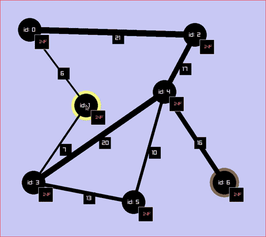

Visualizing graph algorithms with raylib.

implemented algorithms:
* traversal - dfs
* traversal - bfs
* mst - heap prim
* mst - unionfind kruskal
* sssp - heap dijkstra
* sssp - bellman-ford
* apsp - dp floyd-warshall
* approx - approximated min vertex cover

